# PES-VCS: A Version Control System Implementation
#### Akshata Amara | PES1UG24AM025 | Section A | AIML
This repository contains a functional local version control system built from scratch to explore content-addressable storage, tree serialization, and commit history management on Ubuntu 22.04(using WSL).

-----

## Lab Screenshots

### Phase 1: Object Storage
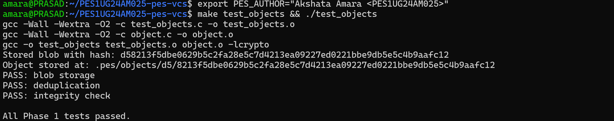
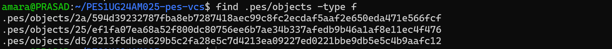

### Phase 2: Tree Objects
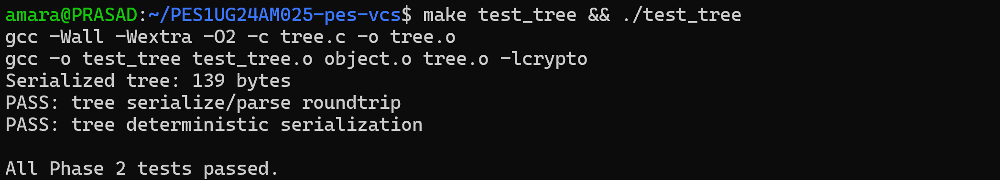
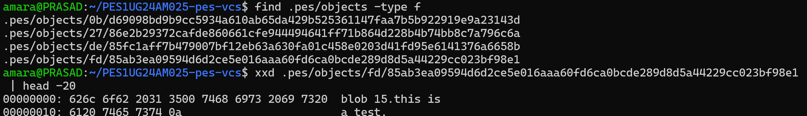
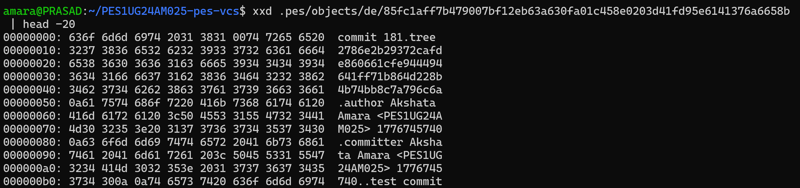

### Phase 3: The Index
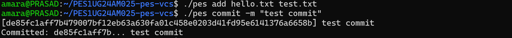
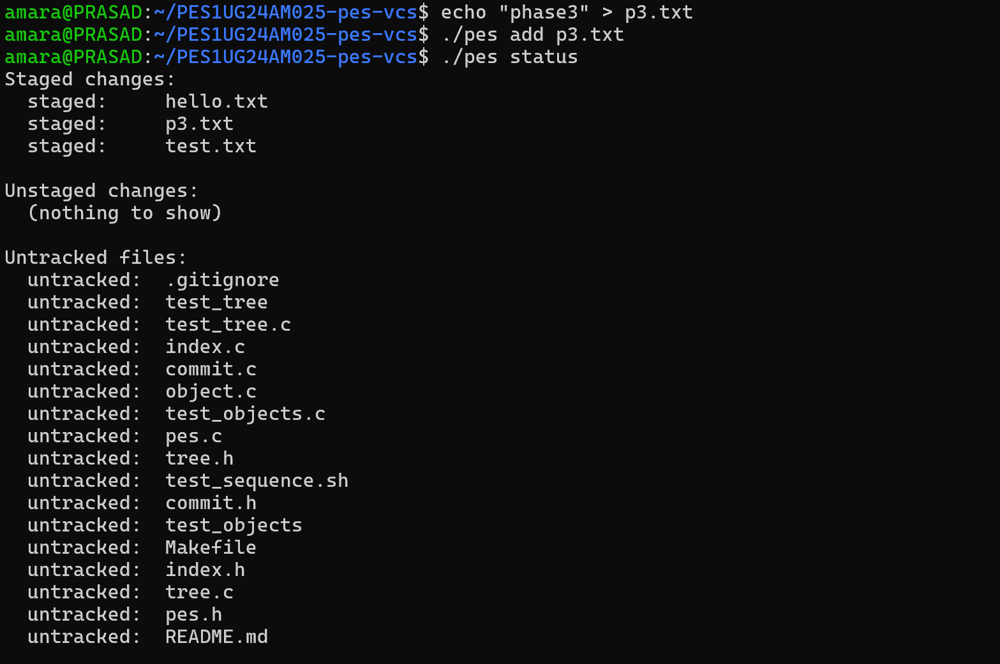
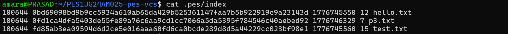

### Phase 4: Commits and History
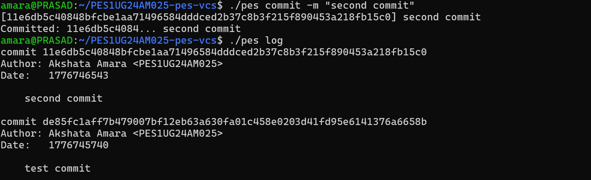
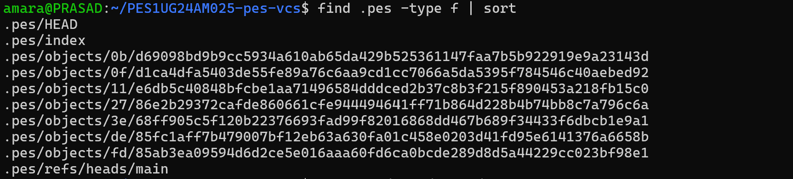
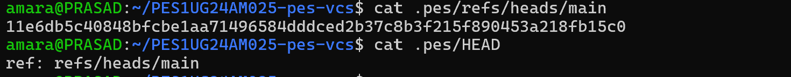

-----

## Analysis Questions

### Branching and Checkout

#### Q5.1: Implementing `pes checkout <branch>`

**Files that change in `.pes/`:**

  - `HEAD` is rewritten to `ref: refs/heads/<branch>`. If the branch is new, a file is created at `.pes/refs/heads/<branch>` containing the target commit hash.

**Working Directory Operations:**

1.  Read the target branch's commit hash from `.pes/refs/heads/<branch>`.
2.  Load that commit object and retrieve its root tree hash.
3.  Walk the target tree recursively; for every file entry, write the corresponding blob contents to the working directory.
4.  Delete files currently tracked in the index that do not exist in the target tree.
5.  Update the index to reflect the target tree's metadata (paths, hashes, modes, and mtimes).

**Complexity:**
The operation is complex because it must handle recursive subdirectory creation/removal, reconcile differences between two distinct snapshots (creation vs. deletion), and protect uncommitted local changes. Additionally, it lacks inherent atomicity; a failure midway leaves the working directory in a corrupted, "half-switched" state.

#### Q5.2: Detecting Dirty Working Directory Conflicts

To detect conflicts using only the index and object store, we iterate through every file in the current index:

1.  **Local Modification Check:** Compare the disk file’s `mtime`/`size` against the index. If they differ, recompute the hash. If the new hash differs from the index hash, the file is locally modified.
2.  **Branch Difference Check:** Load the target commit’s tree. If the blob hash for that path in the target tree differs from the hash in the current index, the branches have diverged on this file.

If a file is **both** locally modified and different between branches, the checkout is refused to prevent the silent destruction of uncommitted work.

#### Q5.3: Detached HEAD and Recovery

**Committing in Detached HEAD:**
Commits are written normally to the object store. However, the system writes the new commit hash directly into the `HEAD` file rather than updating a reference file. While the chain of commits is created successfully, there is no named branch pointing to the tip.

**Recovery:**
Since the objects remain in `.pes/objects/` until garbage collection, a user can recover them by:

1.  Finding the dangling commit hash from terminal output or history.
2.  Manually creating a reference: `echo <hash> > .pes/refs/heads/recovery-branch`.
3.  Pointing `HEAD` back to that reference: `echo "ref: refs/heads/recovery-branch" > .pes/HEAD`.

-----

### Garbage Collection and Space Reclamation

#### Q6.1: Garbage Collection Algorithm

**Algorithm (Mark-and-Sweep):**

1.  **Mark Phase:** Starting from every reference in `.pes/refs/heads/`, walk the commit parent pointers to the root. For every commit, recursively traverse its tree and mark every blob hash encountered as "reachable."
2.  **Sweep Phase:** Enumerate all files in `.pes/objects/`. Reconstruct the hash from the path; if the hash is not in the "reachable" set, delete the file.

**Data Structure:**
A **Hash Set** is ideal for storing reachable hashes, providing $O(1)$ average time complexity for lookups during the sweep phase.

**Estimate for 100,000 Commits / 50 Branches:**
With heavy deduplication and content sharing, one might visit roughly **200,000 to 500,000 unique objects**. A reachable set of this size would occupy approximately **16 MB** of memory (assuming 32-byte hashes).

#### Q6.2: GC Race Condition

**The Race Condition:**

1.  A `commit` operation writes a new blob to the object store (the blob is on disk but not yet linked to a tree).
2.  A concurrent `GC` process scans the refs. Since no commit/tree points to this new blob yet, GC identifies it as unreachable and deletes it.
3.  The `commit` operation then tries to write a tree object pointing to that blob hash, resulting in a broken repository.

**Git’s Prevention Mechanisms:**

  - **Grace Period:** Git enforces a "prune expiration" (default 2 weeks); objects newer than this threshold are never deleted.
  - **Lock Files:** Commit operations create `.lock` files on references, signaling to other processes that an update is in progress.
